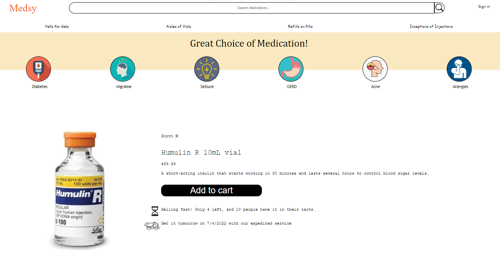

# Medsy - A copycat of Etsy using medications!!!

[Visit Live Site](http://medsy.herokuapp.com/#/)

This website was designed to mimic the original etsy.com website. Rather than using any products, Medsy is configured to only be used for medications. Users can look up medications via search bar or category buttons. Users can also click on any of the medication and be redirected to the medication's show page.

Technologies Used:
HTML
Javascript
CSS
SQL
Ruby on Rails
React and Redux
Webpack
Amazon AWS Storage

Interesting bug fixed:
The route to render search results is:
    <Route exact path="/search/:searched" component={SearchShow} /> 
When a user searched for an empty string, this route was not used since the path was "/search/".
To fix this, I added another route to render the index component:
    <Route exact path="/search" component={MedicationIndexContainer} />
This allowed the index page to show all medications whenever a user searches for an empty string.

