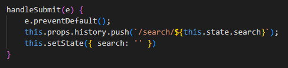

# Medsy - A copycat of Etsy using medications!!!

[Visit Live Site](http://medsy.herokuapp.com/#/)

This website was designed to mimic the original etsy.com website. Rather than using any products, Medsy is configured to only be used for medications. Users can look up medications via search bar or category buttons. Users can also click on any of the medication and be redirected to the medication's show page. This website is dynamic in that it changes shipping date based on current date and saves users who are logged in. Bootstrap was used to make sure users don't have to sign in at every new page load.

## Technologies Used:
- HTML
- Javascript
- CSS
- SQL
- Ruby on Rails
- React and Redux
- Webpack
- Amazon AWS Storage

## Core Features

- ### User Authentication 
    Users are able to sign up, sign in, and sign out. A user remains signed in even when a page is changed or reloaded.
    A registered user's information remains saved and is able to be used again upon signing in. Users can also use a demo
    account to get the full experience.

    

- ### Search
    Users are able to search for a medication and have all of the medications whose name have the keyword to display on the screen. The search bar clears with every search and is able to be reused whether a user is logged in or not.

- ### Medication Listings
    The website is populated by multiple medications that render on the index page. Upon clicking any of the categories on top, all of the medications related to the chosen category are rendered. When clicked, the website redirects the user to a medication's show page, which displays the information about the medications such as description and reviews.

    

- ### Reviews
    This is a feature that is available for every single medication. All users can see reviews, but only logged in users can leave reviews. Additionally, only users who left a particular review can delete that review. Any attempts by non-logged in users to leave a review opens up a modal to prompt the user to login first.

- ### Carts
    This CRUD feature is only available to logged in users. A medication can be added to a cart at any time. Once on the carts page, a user can see the items, adjust the number of items in their cart, and delete the item from their cart. A total price is shown for each medication and the overall cart amount.

    

## Interesting bugs fixed:

- ### 1
The route to render search results is:
    `<Route exact path="/search/:searched" component={SearchShow} />` 
When a user searched for an empty string, this route was not used since the path was "/search/".
To fix this, I added another route to render the index component:
    `<Route exact path="/search" component={MedicationIndexContainer} />`
This allowed the index page to show all medications whenever a user searches for an empty string.

- ### 2
After the using the search bar, the letters that were typed in remained indefinitely until the page was fully reloaded. Thanks to Ricky Zheng's advice, I set state of 'search' (which was connected to the input of the search bar) to an empty string withing handleSubmit() after some text was searched. This assured that whenever something is searched, it's always reset to the original empty string.
 

- ### 3
When I got the total cost of the medications in the cart, the binary nature of Javascript produced results with many decimal places, not just to two decimal places. So, I was able to use
(Math.round(total * 100) / 100) to arrive just two decimal places as intended.

